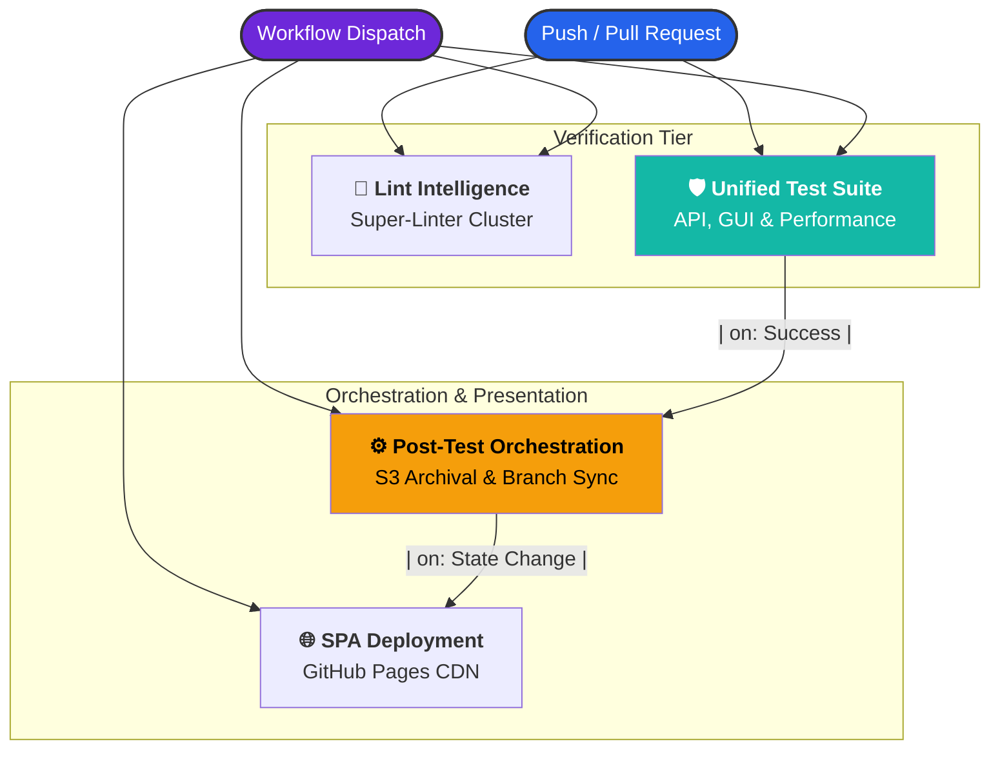

# 
⚙️ AUTOMATION & ORCHESTRATION ARCHITECTURE

  
<i>The central nervous system of the QA Hub ecosystem, ensuring surgical resilience and continuous delivery.</i>

---

## 🏗️ Technical Architecture

Our CI/CD ecosystem is designed for **high-fidelity observability** and rapid feedback loops. We leverage a **Reactive Orchestration Tier** where specialized pipelines respond to the outcome of the primary verification layer.

---

## 📋 Operational Inventory

| Status | Pipeline | Core Responsibility | External Dependency |
| :---: | :--- | :--- | :--- |
| `🧹` | **[Lint Intelligence](./lint.yml)** | Static analysis and zero-debt documentation enforcement. | `qa-hub-actions/lint-codebase` |
| `🛡️` | **[Unified Test Suite](./test_suite.yml)** | Full-stack validation (API, GUI, Performance). | `qa-hub-actions/run-tests` |
| `⚙️` | **[Post-Test Orchestration](./post_test_orchestration.yml)** | Unified S3 Archival and surgical Branch Synchronization. | `qa-hub-actions/sync-from-s3` |
| `🌐` | **[SPA Deployment](./deploy_frontend.yml)** | Production-grade delivery to GitHub Pages CDN. | `qa-hub-actions/deploy-gh-pages` |
| `🏷️` | **[PR Intelligence](./pr_intelligence.yml)** | Dynamic labeling and smart reviewer briefs. | `actions/labeler@v5` |
| `👤` | **[Auto Assign](./auto_assign.yml)** | Automated ownership management for contributions. | Native `gh` CLI |

---

## 🔍 Deep Dive: Core Orchestration

### 🛡️ Unified Test Suite
The flagship verification layer. It materializes a temporary instance of the entire dashboard ecosystem to execute high-fidelity scenarios.
- **Compute Cluster**: Ubuntu Latest, Node.js 20, Python 3.11.
- **Tiers**: API (Behave), Performance (Locust), and GUI (Selenium/Chrome).
- **Artifacts**: JUnit XML, High-Res Screenshots, and Performance Dossiers.

### ⚙️ Post-Test Orchestration
A reactive bridge that consolidates S3 archival and branch synchronization. It ensures the repository state reflects the latest verification results without manual intervention.
- **Trigger**: Automatic execution upon `Unified Test Suite` success (targets `main` PRs).
- **Archival**: Surgical synchronization with AWS S3 infrastructure.
- **State Sync**: Pulls artifacts from S3 and commits them directly to the active feature branch.
- **Impact**: Automatically triggers the **SPA Deployment** layer upon branch synchronization.

### 🧹 Lint Intelligence
Maintains the aesthetic and structural "Gold Standard" of the codebase.
- **Protocols**: Python (Pep8), YAML, Markdown (MDLint), and Actions.
- **Gatekeeping**: Mandatory green status for all Pull Request manifestations.

---

## 🛠️ Mission-Control Guide

To trigger any of these verification or orchestration layers manually:
1. Navigate to the **[GitHub Actions Console](https://github.com/carlos-camara/dashboard/actions)**.
2. Select your target pipeline from the high-fidelity registry.
3. Pulse the **Run workflow** toggle and select your target deployment branch.

---
> [!IMPORTANT]
> **Orchestration Migration**
> All pipelines have been migrated to the centralized **[QA Hub Actions](https://github.com/carlos-camara/qa-hub-actions)** repository for standardized, global lifecycle management.

*Design & Engineering Oversight by Carlos Cámara*
