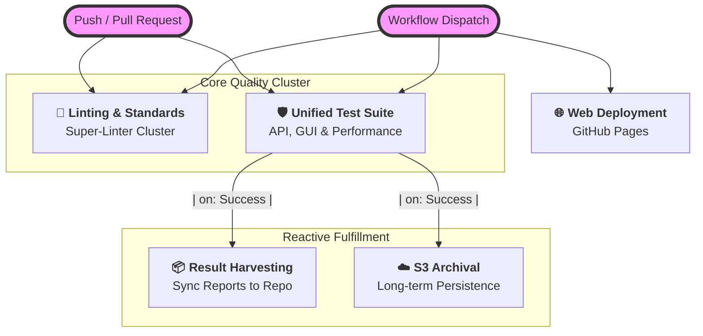

# �️ Automation & CI/CD Hub

Welcome to the central nervous system of the **QA Hub Dashboard**. This directory houses the GitHub Actions workflows that ensure our software is resilient, consistent, and always ready for deployment.

---

## 🏗️ Technical Architecture

Our CI/CD pipeline is designed for high observability and rapid feedback. We leverage a reactive architecture where specialized pipelines respond to the outcome of the main test suite.

---

## 📋 Workflow Directory

| Status | Pipeline | Core Responsibility | External Dependency |
| :---: | :--- | :--- | :--- |
| `🧹` | **[Lint Codebase](./lint.yml)** | Static analysis, YAML validation & formatting. | `qa-hub-actions/lint-codebase` |
| `🛡️` | **[Unified Test Suite](./test_suite.yml)** | Multi-layer validation (API, Performance, GUI). | `qa-hub-actions` (Shared Suite) |
| `📦` | **[Upload Results](./upload_results.yml)** | Aggregation of evidence and JUnit publishing. | `qa-hub-actions/collect-and-publish` |
| `🌐` | **[Deploy Frontend](./deploy_frontend.yml)** | Production delivery to GitHub Pages. | `qa-hub-actions/deploy-gh-pages` |
| `☁️` | **[Deploy Reports S3](./deploy_reports_s3.yml)** | Data persistence in AWS S3 infra. | `qa-hub-actions/deploy-reports-s3` |
| `👤` | **[Auto Assign PR](./auto_assign.yml)** | Automated ownership assignment for PRs. | Native `gh` CLI |
| `🏷️` | **[PR Labeler](./pr_labeler.yml)** | Automatic categorization based on file paths. | `actions/labeler` |

---

## � Deep Dive: Core Pipelines

### 🛡️ Unified Test Suite
The flagship validation process. It spins up a temporary instance of the entire dashboard ecosystem to run complex interactive scenarios.
- **Environment**: Ubuntu Latest, Node.js 20, Python 3.11.
- **Services**: Frontend (Vite) + Backend (Node/Express).
- **Validation Layers**:
  - **API**: Behave-driven smoke tests.
  - **Performance**: High-density audit dossiers.
  - **GUI**: Selenium-based interaction flows.

### 📦 Upload Test Results
A reactive pipeline that ensures all test evidence and JUnit data are aggregated and published as a unified suite summary.
- **Mechanism**: Triggered by `workflow_run` completion.
- **Evidence**: Fetches screenshots, JUnit XMLs, and performance reports.
- **Persistence**: Publishes the "Unified Test Report" summary back to the pull request.

> [!CAUTION]
> **Infinite Loop Guard**: The Upload Pipeline uses specialized Git tokens. Ensure `[skip ci]` remains in the commit message template to prevent recursive workflow triggers.

### 🧹 Lint - Super-Linter
Maintains the aesthetic and structural integrity of our code.
- **Scope**: Python, YAML, Markdown, and GitHub Actions.
- **Rule**: Enforced on every Pull Request. "Green" status is mandatory for merging.

---

## 🛠️ Operational Guide

To trigger any of these workflows manually:
1. Navigate to the **[Actions](https://github.com/carlos-camara/dashboard/actions)** tab.
2. Select your target pipeline from the sidebar.
3. Click **Run workflow** and select your branch.

---
> [!IMPORTANT]
> **Action Migration**
> All workflows have been migrated to use the centralized **[QA Hub Actions](https://github.com/carlos-camara/qa-hub-actions)** repository. This allows for global updates to our automation logic without individual repository modifications.

*Maintained by Carlos Cámara*
