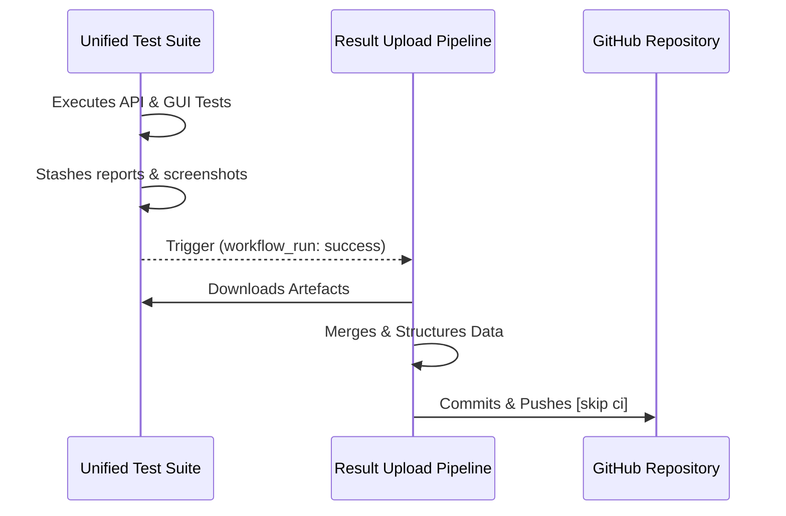

# Post-Test Result Upload Pipeline

This specialized workflow centralizes the management of reports and visual evidence generated by the unified test suite.

## 🔄 Orchestration Flow

## 🛠 How it Works

The `.github/workflows/upload_results.yml` is reactive. It only starts when **"Unified Test Suite"** completes with a `success` status on the same branch.

### Core Processing Steps

1. **Reactive Trigger**: Listens for the completion of the main suite.
2. **Context Recovery**: Checks out the exact code revision that originated the tests (using `head_branch`).
3. **Artifact Harvesting**: Fetches stashed results from the cloud:
   - `api-reports`: Technical JUnit XMLs.
   - `gui-reports`: Visual interaction summaries.
   - `gui-screenshots`: HD evidence of the application state.
4. **Structured Merge**:
   - Aggregates all JUnit files into the `reports/` directory.
   - Synchronizes visual evidence into `features/resources/screenshots/`.
5. **Persistent Storage**: Publishes the updates back to the branch with an automated commit message.

## 🌟 Strategic Benefits

- **Isolation**: Test execution is never slowed down by Git operations or network latency during uploads.
- **Clean History**: The main test suite stays focused on validation, while this pipeline handles documentation.
- **Data Integrity**: Ensures the `reports/` folder in the repository is a live reflection of the latest "Green" build.

> [!CAUTION]
> **Commit Loop Prevention**: The pipeline uses the `[skip ci]` tag in its commit messages. NEVER remove this tag, or you will trigger an infinite loop of test executions.
