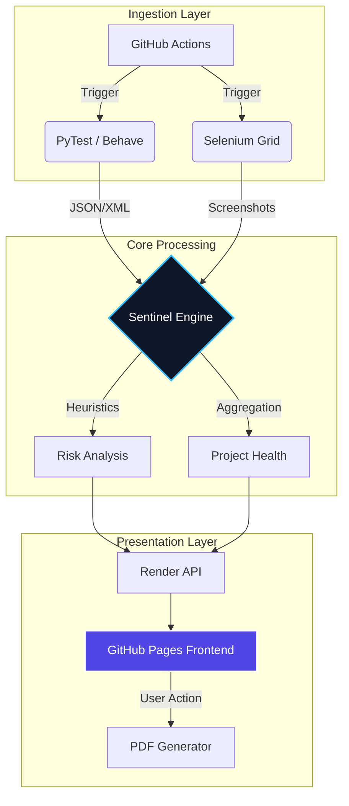

# QA COMMAND CENTER

> [!IMPORTANT]
> **NEXT-GEN TEST ORCHESTRATION & INTELLIGENCE PLATFORM**
>
> An ultra-premium visualization layer that bridges the gap between technical execution logs and executive decision-making.

[](https://www.python.org/)
[](https://react.dev/)
[](https://tailwindcss.com/)
[](LICENSE)

<br/>


## 🌌 MISSION OVERVIEW

**SENTINEL** is not just a dashboard; it's a **Quality Assurance Operating System**. Designed for high-velocity engineering teams, it consumes test telemetry from disparate sources (API Smoke, GUI Regression, Load Tests) and synthesizes them into a unified, glass-morphic interface.

We have moved beyond "Pass/Fail". We provide **Context, Trend Analysis, and Visual Proof**.

---

## ⚡ CORE CAPABILITIES

### 📱 **Hyper-Responsive Mobile Architecture**
Engineered with a **"Mobile-First, Desktop-Ultra"** philosophy. The entire command center adapts fluidly to any viewport.
*   **Touch-Optimized Controls**: Sliding date toggles and large targets for field usage.
*   **Off-Canvas Navigation**: Smooth, native-app like sidebar transitions.
*   **Adaptive Grids**: Data panels intelligently stack and resize for phone screens without losing fidelity.

### 📄 **Executive Intelligence Dossiers (PDF)**
Generate professional-grade PDF reports with a single click.
*   **Automated Synthesis**: Compiles health metrics, failure taxonomies, and risk assessments into a clean document.
*   **Stakeholder Ready**: Formatted specifically for C-level review—clean, concise, and branded.
*   **Instant Export**: Available globally via the dashboard header actions.

### 🎨 **"Ultra Premium" Visual Language**
A redesign focused on clarity, depth, and futuristic aesthetics.
*   **Glassmorphism**: Apple-vision-pro inspired translucency and blur effects.
*   **Live Telemetry**: Pulsing indicators for system status and real-time connectivity.
*   **Motion Design**: Interactive hover states, sliding toggles, and smooth ingress animations.

---

## 📸 VISUAL RECONNAISSANCE

### 1. The Command Deck
*Real-time situational awareness of your quality landscape.*
<div align="center">
  
</div>

<br/>

### 2. Surgical Precision (Run Details)
*Drill down from global trends to individual atomic failures with millisecond precision.*
<div align="center">
  
</div>

<br/>

### 3. Action & Control Layer
*Fluid controls for time-travel (7D/30D) and data synchronization.*
<div align="center">
  
</div>

---

## 🏗️ SYSTEM ARCHITECTURE



---

## 🚀 DEPLOYMENT PROTOCOLS

### Local Development
Initialize the Sentinel environment on your local machine.

```bash
# 1. Clone the repository
git clone https://github.com/carlos-camara/dashboard.git

# 2. Ignite Backend & Test Engine
python -m venv .venv
source .venv/bin/activate
pip install -r requirements.txt

# 3. Launch UI Matrix
npm install
npm run dev
```

### Execution Commands

| Directive | Command | Description |
| :--- | :--- | :--- |
| **GUI Validation** | `npm run test:gui` | Launches full visual regression suite |
| **API Check** | `npm run test:api` | Fast execution of API contract tests |
| **Generate Report**| via UI | Click the "Download" icon in header |

---

> **Designed & Engineered by [Carlos Camara](https://github.com/carlos-camara)**
> *Quality is not an act, it is a habit.*
