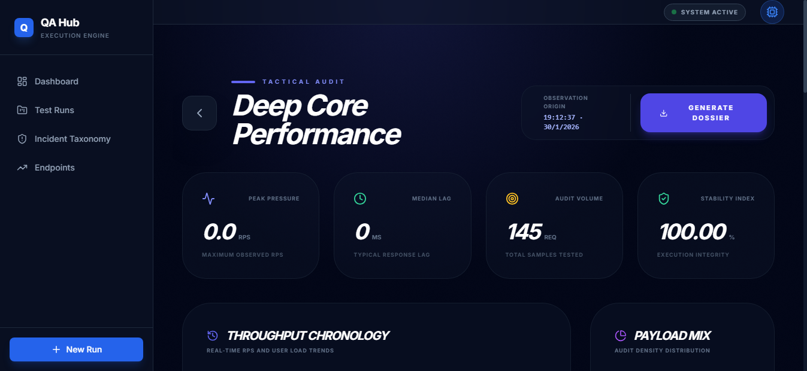
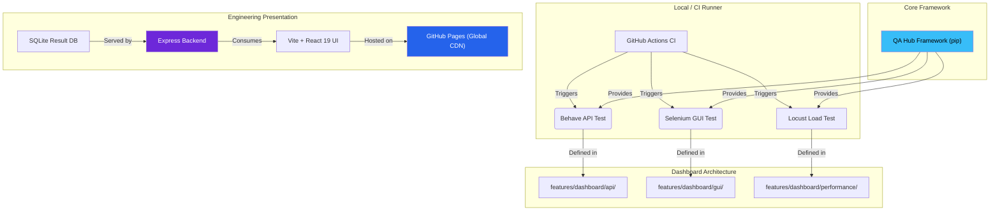

# <div align="center">🛡️ QA COMMAND CENTER</div>

<div align="center">
  <h3>Next-Gen Orchestration & Engineering Intelligence</h3>
  <p><i>A high-performance, ultra-premium observation layer bridging technical execution and executive decision-making.</i></p>
</div>

<div align="center">

[](https://www.python.org/)
[](https://react.dev/)
[](https://tailwindcss.com/)
[](LICENSE)

[](https://github.com/carlos-camara/dashboard/actions/workflows/lint.yml)
[](https://github.com/carlos-camara/dashboard/actions/workflows/test_suite.yml)

</div>

<br/>


---

## 🌟 Executive Overview

This is more than a dashboard; it is a **mission-critical ecosystem** for modern engineering teams. Engineered with a **Glassmorphism UI**, it provides surgical-grade insights into your multi-project quality landscape, transforming chaotic logs into actionable intelligence.

### 🚀 The Four Pillars
- **Unified Vision**: Aggregated reporting for API (Behave) and GUI (Selenium) test suites in a single pane.
- **Smart Diagnostics**: Automated failure pattern recognition with immersive visual evidence.
- **Performance Digital Twin**: Real-time signal analysis and regression detection using Recharts analytics.
- **Enterprise-Grade CI**: Fully automated lifecycle from linting to report archival in AWS S3.

---

## 🌐 Live Experience

The future of test reporting is already online. Experience the ultra-premium interface here:

> **[🚀 Access Live Dashboard](https://carlos-camara.github.io/dashboard/)**

---

## ✨ Cutting-Edge Features

### 📊 Performance Digital Twin
Go beyond binary pass/fail results. Our **Performance Analytics Engine** establishes a technical baseline for your system's health.
- **Signal Velocity**: Interactive time-series charts visualizing throughput trends.
- **Throughput Chronology**: Surgical detection of regression spikes and latency drifts.
- **Spectral Latency Audit**: A heat-map of system responsiveness and SLA adherence.



### 🤖 PR Intelligence
Maximize developer focus with an automated pull request management system:
- **Auto-Labeler**: Precise categorization (`DevOps`, `QA`, `Frontend`, `Backend`) based on modified file paths.
- **Auto-Assigner**: Automatic ownership assignment to ensure rapid review cycles.
- **Smart Formatting**: Enforced markdown standards for clean, readable documentation.

### 📑 Intelligent PDF Dossiers
Export executive-ready artifacts with a single click. These **Intelligent Dossiers** include:
- **Executive KPI Grid**: High-level success metrics.
- **Visual Evidence Engine**: Embedded high-resolution screenshots for every failure.
- **SLA Violation Logs**: Detailed breakdown of performance threshold breaches.

### 🧠 Tactical Intelligence Actions
Automated workflows that extend the capabilities of the core dashboard:
- **Environment Guardian**: Automated health checks, DB integrity audits, and safe teardowns.
- **Visual Sentinel**: Automated regression detection with visual masking and artifact promotion.
- **Release Oracle**: Automated discovery and publishing of QA release notes based on BDD coverage.

---

## 🏗️ Decoupled Architecture & Shared Core

We leverage a modern, **decoupled architecture** designed for high-availability engineering teams. The core automation logic is powered by the **[QA Hub Framework](https://github.com/carlos-camara/qa-hub-framework)**, a centralized Python package.



---

## 🛠️ Unified CI/CD Ecosystem

Our pipelines are powered by the **[QA Hub Actions](https://github.com/carlos-camara/qa-hub-actions)** library, ensuring global standards across all repositories.

| Status | Pipeline | Core Responsibility |
| :---: | :--- | :--- |
| `🧹` | **Lint Codebase** | Super-Linter enforcement for zero-debt documentation and code. |
| `🛡️` | **Unified Suite** | Parallel execution of API, GUI, and Performance layers. |
| `📦` | **Upload Results** | Automated merging and committing of timestamped reports. |
| `☁️` | **AWS S3 Archive** | Long-term persistence for historical quality analysis. |
| `🏷️` | **PR Intelligence** | Dynamic labeling and contributor assignment. |

---

## 🚦 Quick Start

### 📋 Environment Requirements
- **Python 3.11+** | **Node.js 20+** | **Chrome/Chromedriver**

### 💻 Local Deployment

1. **Clone & Explore**:
   ```bash
   git clone https://github.com/carlos-camara/dashboard.git
   cd dashboard
   ```

2. **Core Services & UI**:
   ```bash
   npm install
   npm run start-backend  # Terminal 1
   npm run dev            # Terminal 2
   ```

3. **Automation Engine**:
   ```bash
   python -m venv .venv
   .venv\Scripts\activate
   pip install -r requirements.txt
   ```

---

## 🛡️ Support & Security

We maintain the highest standards for our engineering tools.
- **Security Policy**: Read our [Security Procedures](SECURITY.md).
- **Contributing**: Check our [Engineering Standards](CONTRIBUTING.md).
- **Changelog**: Follow our evolution in the [Changelog](CHANGELOG.md).

---
<div align="center">
  <i>Designed & Engineered by <b>[Carlos Cámara](https://github.com/carlos-camara)</b></i>
</div>
