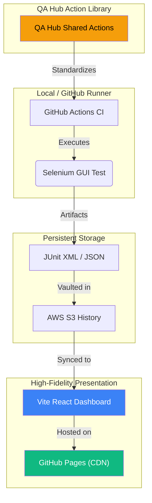

# <div align="center">🛡️ QA COMMAND CENTER</div>

<div align="center">
  <h3>Next-Gen Orchestration & Engineering Intelligence</h3>
  <p><i>A high-performance, ultra-premium observation layer bridging technical execution and executive decision-making.</i></p>
</div>

<div align="center">

<div align="center">

[](https://www.python.org/)
[](https://react.dev/)
[](https://vitejs.dev/)
[](https://tailwindcss.com/)

[](https://github.com/carlos-camara/dashboard/actions/workflows/lint.yml)
[](https://github.com/carlos-camara/dashboard/actions/workflows/test_suite.yml)
[](https://github.com/carlos-camara/dashboard/actions/workflows/deploy_frontend.yml)

</div>

<br/>


---

## 📑 Table of Contents

- [Executive Overview](#-executive-overview)
- [Live Experience](#-live-experience)
- [Features at a Glance](#-features-at-a-glance)
- [Cutting-Edge Features](#-cutting-edge-features)
  - [PR Intelligence](#-pr-intelligence)
  - [Intelligent PDF Dossiers](#-intelligent-pdf-dossiers)
- [Architecture](#%EF%B8%8F-architecture--lightweight-spa)
- [CI/CD Ecosystem](#%EF%B8%8F-unified-cicd-ecosystem)
- [Quick Start](#-quick-start)
- [Testing](#-testing)
- [Project Structure](#-project-structure)
- [Contributing](#-contributing)
- [Support & Security](#%EF%B8%8F-support--security)

---

## 🌟 Executive Overview

This is more than a dashboard; it is a **mission-critical ecosystem** for modern engineering teams. Engineered with an ultra-premium **Glassmorphism UI**, it provides surgical-grade insights into your multi-project quality landscape, transforming complex test logs into actionable intelligence.

### 🚀 The Four Pillars
- **Unified Vision**: High-fidelity GUI (Selenium) test reporting with exhaustive visual verification.
- **Smart Diagnostics**: Automated failure pattern recognition with immersive visual evidence captured during execution.
- **Decoupled Architecture**: High-performance Single Page Application (SPA) designed for zero-latency data visualization.
- **Enterprise-Grade CI**: Fully automated lifecycle from linting to report archival in AWS S3 using QA Hub Actions.

---

## 🌐 Live Experience

The future of test reporting is already online. Experience the ultra-premium interface here:

> **[🚀 Access Live Dashboard](https://carlos-camara.github.io/dashboard/)**

---

## 📊 Features at a Glance

| Feature | Description | Technology |
|---------|-------------|------------|
| **Test Reporting** | Exhaustive GUI test reporting | Behave, Selenium |
| **Visual Evidence** | Automatic screenshot capture & archival | html2canvas |
| **PDF Export** | Executive-ready dossiers | jsPDF, Custom rendering |
| **S3 Integration** | Automated report synchronization | AWS SDK |
| **PR Automation** | Smart labeling, assignment, summarization | GitHub Actions, gh CLI |
| **SPA Routing** | Client-side navigation with 404 handling | React Router |
| **CI/CD** | Full automation pipeline | GitHub Actions, QA Hub Actions |

---

## ✨ Cutting-Edge Features

### 🤖 PR Intelligence
Maximize developer focus with an automated pull request management system:
- **Auto-Labeler**: Precise categorization (`DevOps`, `QA`, `Frontend`) based on modified file paths.
- **Enhanced Reviewer Intelligence**: Changed files are automatically grouped by purpose (e.g., 🧪 BDD Scenarios, 🐍 Python Logic) and presented in **collapsible sections**.
- **Smart Checklists**: "Automated Tests" and "Linting" checkboxes are automatically updated by CI upon success.
- **High-Fidelity Reporting**: Full test results are injected directly into PR descriptions with a visual summary table.
- **SPA Deployment**: GitHub Pages deployment supports Single Page Application routing via `.nojekyll` and `404.html`.

### 📑 Intelligent PDF Dossiers
Export executive-ready artifacts with a single click. These dossiers include:
- **Executive KPI Grid**: High-level success metrics and project health.
- **Visual Evidence Engine**: Embedded high-resolution screenshots for failures.
- **Architecture Insights**: Technical summary of the audited system.

---

## 🏗️ Architecture & Lightweight SPA

We leverage a modern, decoupled architecture designed for high availability and serverless distribution.



> [!TIP]
> This architecture is strictly frontend-first. Data is synchronized directly from S3 artifacts into the dashboard's state, eliminating the need for a persistent backend server or database during presentation.

---

## 🛠️ Unified CI/CD Ecosystem

Our pipelines are powered by the **[QA Hub Actions](https://github.com/carlos-camara/qa-hub-actions)** library, ensuring global standards across all repositories.

| Status | Pipeline | Core Responsibility |
| :---: | :--- | :--- |
| `🧹` | **Lint Codebase** | Super-Linter enforcement for zero-debt documentation and code. |
| `🛡️` | **Unified Suite** | Parallel execution of GUI and Visual Regression layers. |
| `☁️` | **Deploy to S3** | Upload test artifacts to AWS S3 for long-term persistence. |
| `🔄` | **Sync from S3** | Automatic synchronization of S3 reports to repository. |
| `🚀` | **Deploy Frontend** | Automated deployment to GitHub Pages with SPA support. |
| `🏷️` | **PR Intelligence** | Dynamic labeling, assignment, and auto-summarization. |

---

## 🚦 Quick Start

### 📋 Prerequisites

Ensure you have the following installed:
- **Python 3.11+** - [Download](https://www.python.org/downloads/)
- **Node.js 20+** - [Download](https://nodejs.org/)
- **Chrome/Chromedriver** - Required for GUI execution.

### 💻 Installation & Setup

1. **Clone the Repository**:
   ```bash
   git clone https://github.com/carlos-camara/dashboard.git
   cd dashboard
   ```

2. **Install Frontend Dependencies**:
   ```bash
   npm install
   ```

3. **Install Automation Framework**:
   ```bash
   python -m venv .venv
   .venv\Scripts\activate  # Windows
   pip install -r requirements.txt
   ```

4. **Environment Configuration**:
   ```bash
   # Create .env from template
   cp .env.example .env
   # Configure your AWS_S3_BUCKET and VITE_API_URL (S3 Proxy or Mock)
   ```

5. **Launch Development Environment**:
   ```bash
   npm run dev
   ```

> [!IMPORTANT]
> This project operates in a **Backend-less Mode** by default, synchronizing test results directly from **AWS S3**. Ensure your AWS credentials are properly configured in `.env` for data persistence.

---

## 🧪 Testing

This ecosystem features a multi-layered verification strategy powered by the **QA Hub Framework**.

### 🏃 Local Execution

```bash
# Activate Python environment
.venv\Scripts\activate

# UI Visual Integrity (Selenium)
behave features/dashboard/gui --tags=@smoke
```

### 📁 Test Configuration
- `behave.ini`: Global test runner settings.
- `features/config/config.yaml`: Environment and viewport orchestration.
- `features/environment.py`: Strategic hook logic and data seeding.

---

## 📁 Project Structure

```text
dashboard/
├── .github/workflows/   # CI/CD pipelines (QA Hub Standard)
├── components/          # React SPA UI components (Tailwind + Framer)
├── features/            # BDD Verification Layer
│   ├── dashboard/       # Project-specific feature files
│   ├── page_objects/    # Decoupled YAML Locators (POM)
│   ├── resources/       # Visual Baselines & Screenshots
│   └── steps/           # Python Step Definitions
├── reports/             # Local test results & JUnit XML
├── scripts/             # Infrastructure & Utility scripts
├── services/            # Frontend services (S3 Sync, Report Parsers)
├── index.html           # SPA Entry Point
└── vite.config.js       # Vite Orchestration
```

---

## 🤝 Community & Standards

We maintain an ultra-premium engineering standard. Contributions are welcome!

| Standard | Documentation |
| :--- | :--- |
| **Engineering Standards** | [Contributing Guidelines](CONTRIBUTING.md) |
| **Security Protocol** | [Security Policy](SECURITY.md) |
| **Evolution Tracking** | [Changelog](CHANGELOG.md) |
| **Code of Conduct** | [Ethical Standards](CODE_OF_CONDUCT.md) |

---

<div align="center">
  <br/>
  <p><i>Orchestrated with precision by <b><a href="https://github.com/carlos-camara">Carlos Cámara</a></b></i></p>
  <p>🚀 <b>Next-Gen Engineering Logic</b></p>
</div>
