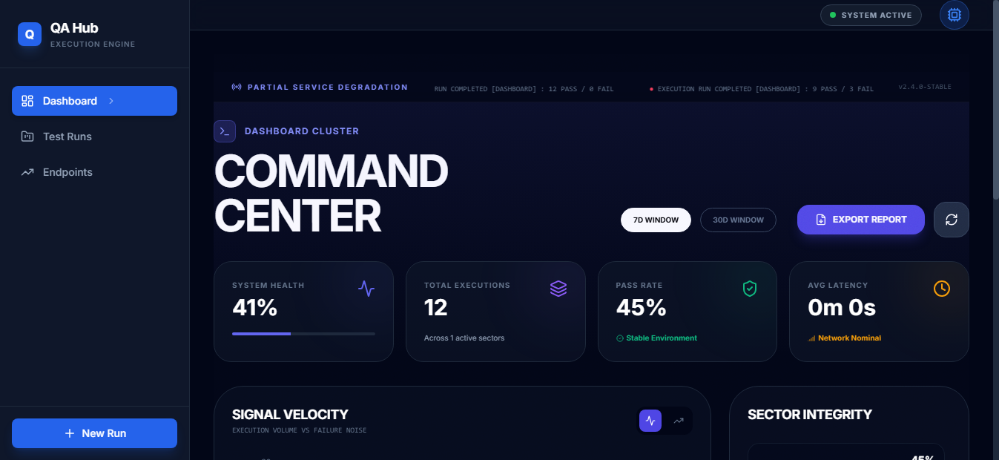
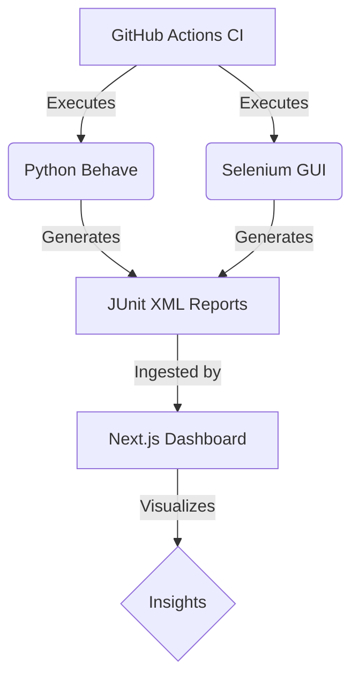

# 💎 Ultra-Premium QA Automation Dashboard
> **The ultimate command center for Multi-Project Test Orchestration & Validation.**

[](https://github.com/carlos-camara/dashboard/actions)
[](LICENSE)
[](https://www.python.org/)
[](https://nodejs.org/)


## 🌟 Executive Overview

This is not just another test runner. This is a **high-performance, ultra-premium QA ecosystem** designed to bridge the gap between technical BDD execution and executive-level visibility. Built with a state-of-the-art **Glassmorphism UI**, it provides real-time insights into your multi-project quality landscape.

### 🚀 Key Pillars
- **Unified Vision**: One dashboard for API (Behave) and GUI (Selenium) test suites.
- **Micro-Services Ready**: Validates complex REST flows with professional-grade diagnostics.
- **Real-Time Analytics**: Instant visualization of success rates, volume trends, and failure patterns.
- **Enterprise-Grade UI**: immersive dark mode, fluid responsiveness, and premium aesthetics.

---

## 🎨 Design & Experience

Our dashboard is built with a focus on **visual excellence** and **user experience**.

| Glassmorphism Excellence | Data-Driven Insights |
| :--- | :--- |
|  |  |
| **Precision Statistics**: High-level overview of success rates and test volume. | **Execution Trends**: Track your quality stability over time. |

### 📱 Fully Responsive
Whether you are on a 4K monitor or a mobile device, the dashboard adapts perfectly.


---

## 🛠 Feature Showcase

### 🔍 Deep API Validation
Leverage Python's **Behave** to write human-readable tests while performing deep technical assertions:
- **Contract Testing**: Automatic schema and type validation.
- **Performance Benchmarking**: Monitor response times against SLA thresholds.
- **Traced Requests**: Full headers and body logging for friction-less debugging.

### 🌐 Scalable GUI Automation
Custom **Page Object Model (POM)** implementation with centralized locators:
- **YAML-driven Locators**: Maintain tests without touching code.
- **Automatic Syncing**: Reliable element interaction with intelligent waits.
- **Visual Proof**: Automated screenshots on failure (or on demand).

### 📊 Integrated Catalog
Maintain a clean inventory of all your endpoints and their health status.


---

## 🏗 Project Architecture



---

## 🚦 Getting Started

### 📋 Prerequisites
- **Python 3.11+**
- **Node.js 20+**
- **Chromedriver** (for GUI tests)

### 💻 Local Installation

1. **Clone the repository**:
   ```bash
   git clone https://github.com/carlos-camara/dashboard.git
   cd dashboard
   ```

2. **Setup Python Environment**:
   ```bash
   python -m venv .venv
   source .venv/bin/activate  # Windows: .venv\Scripts\activate
   pip install -r requirements.txt
   ```

3. **Setup Dashboard**:
   ```bash
   npm install
   ```

---

## 🏃 Execution Commands

| Task | Command |
| :--- | :--- |
| **Run API Tests** | `./run_api_smoke_reports.ps1` |
| **Run GUI Tests** | `./run_gui_smoke_reports.ps1` |
| **Start Dashboard** | `npm run dev` |
| **Full CI Simulation** | `npm test` |

---

## 🛡️ Robust CI/CD
Our **GitHub Actions** pipeline ensures every PR is validated:
- **Linting**: Enforces strict code quality.
- **Functional Testing**: Runs the unified test suite.
- **Auto-Publishing**: Test reports are automatically merged and pushed back to the docs.

---
> Created with by Carlos Camara
