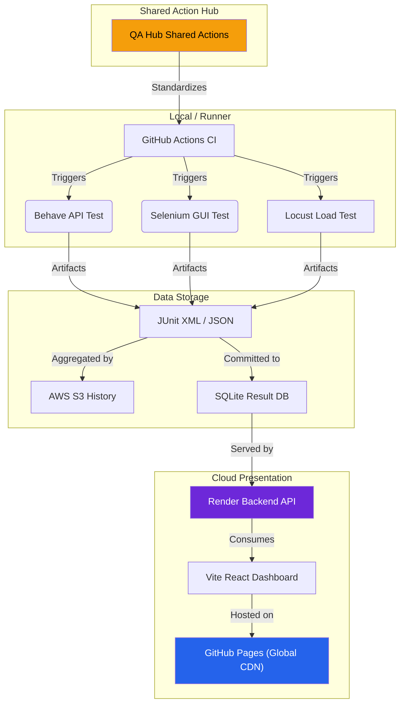

# <div align="center">🛡️ QA COMMAND CENTER</div>

<div align="center">
  <h3>Next-Gen Orchestration & Engineering Intelligence</h3>
  <p><i>A high-performance, ultra-premium observation layer bridging technical execution and executive decision-making.</i></p>
</div>

<div align="center">

[](https://www.python.org/)
[](https://react.dev/)
[](https://tailwindcss.com/)
[](LICENSE)

[](https://github.com/carlos-camara/dashboard/actions/workflows/lint.yml)
[](https://github.com/carlos-camara/dashboard/actions/workflows/test_suite.yml)
[](https://github.com/carlos-camara/dashboard/actions/workflows/deploy_frontend.yml)

</div>

<br/>


---

## 📑 Table of Contents

- [Executive Overview](#-executive-overview)
- [Live Experience](#-live-experience)
- [Features at a Glance](#-features-at-a-glance)
- [Cutting-Edge Features](#-cutting-edge-features)
  - [Performance Digital Twin](#-performance-digital-twin)
  - [PR Intelligence](#-pr-intelligence)
  - [Intelligent PDF Dossiers](#-intelligent-pdf-dossiers)
- [Architecture](#%EF%B8%8F-architecture--decoupled-stack)
- [CI/CD Ecosystem](#%EF%B8%8F-unified-cicd-ecosystem)
- [Quick Start](#-quick-start)
- [Testing](#-testing)
- [Project Structure](#-project-structure)
- [Contributing](#-contributing)
- [Support & Security](#%EF%B8%8F-support--security)

---

## 🌟 Executive Overview

This is more than a dashboard; it is a **mission-critical ecosystem** for modern engineering teams. Engineered with a **Glassmorphism UI**, it provides surgical-grade insights into your multi-project quality landscape, transforming chaotic logs into actionable intelligence.

### 🚀 The Four Pillars
- **Unified Vision**: Aggregated reporting for API (Behave) and GUI (Selenium) test suites in a single pane.
- **Smart Diagnostics**: Automated failure pattern recognition with immersive visual evidence.
- **Performance Digital Twin**: Real-time signal analysis and regression detection using Recharts analytics.
- **Enterprise-Grade CI**: Fully automated lifecycle from linting to report archival in AWS S3.

---

## 🌐 Live Experience

The future of test reporting is already online. Experience the ultra-premium interface here:

> **[🚀 Access Live Dashboard](https://carlos-camara.github.io/dashboard/)**

---

## 📊 Features at a Glance

| Feature | Description | Technology |
|---------|-------------|------------|
| **Test Aggregation** | Unified API & GUI test reporting | Behave, Selenium |
| **Performance Analytics** | Time-series metrics & regression detection | Recharts, Custom algorithms |
| **Visual Evidence** | Automatic screenshot capture & archival | html2canvas |
| **PDF Export** | Executive-ready dossiers | jsPDF, Custom rendering |
| **S3 Integration** | Automated report synchronization | AWS SDK |
| **PR Automation** | Smart labeling, assignment, summarization | GitHub Actions, gh CLI |
| **SPA Routing** | Client-side navigation support | React Router |
| **Live Backend** | Real-time data API | Express.js, SQLite |
| **CI/CD** | Full automation pipeline | GitHub Actions, QA Hub Actions |

---

## ✨ Cutting-Edge Features

### 📊 Performance Digital Twin
Go beyond binary pass/fail results. Our **Performance Analytics Engine** establishes a technical baseline for your system's health.
- **Signal Velocity**: Interactive time-series charts visualizing throughput trends.
- **Throughput Chronology**: Surgical detection of regression spikes and latency drifts.
- **Spectral Latency Audit**: A heat-map of system responsiveness and SLA adherence.


### 🤖 PR Intelligence
Maximize developer focus with an automated pull request management system:
- **Auto-Labeler**: Precise categorization (`DevOps`, `QA`, `Frontend`, `Backend`) based on modified file paths.
- **Enhanced Reviewer Intelligence**: Changed files are automatically grouped by purpose (e.g., 🧪 BDD Scenarios, 🐍 Python Logic) and presented in **collapsible sections** for a cleaner, organized view.
- **Smart Checklists**: "Automated Tests" and "Linting" checkboxes in PRs are automatically checked by CI upon success, providing instant feedback.
- **High-Fidelity Reporting**: Full test results are injected directly into the PR description with a visual summary table, eliminating the need to dig through logs.
- **SPA Deployment**: GitHub Pages deployment now supports Single Page Application routing via `.nojekyll` and `404.html` handling.
- **Auto-Assigner**: Automatic ownership assignment to ensure rapid review cycles.
- **Milestone Management**: Automatic assignment to latest active milestone.

### 📑 Intelligent PDF Dossiers
Export executive-ready artifacts with a single click. These **Intelligent Dossiers** include:
- **Executive KPI Grid**: High-level success metrics.
- **Visual Evidence Engine**: Embedded high-resolution screenshots for every failure.
- **SLA Violation Logs**: Detailed breakdown of performance threshold breaches.

---

## 🏗️ Architecture & Decoupled Stack

We leverage a modern, decoupled architecture designed for scale and zero-downtime reliability.



> [!TIP]
> The architecture separates concerns: test execution (GitHub Actions), data storage (S3 + SQLite), backend API (Render), and frontend (GitHub Pages). This enables independent scaling and zero-downtime deployments.

---

## 🛠️ Unified CI/CD Ecosystem

Our pipelines are powered by the **[QA Hub Actions](https://github.com/carlos-camara/qa-hub-actions)** library, ensuring global standards across all repositories.

| Status | Pipeline | Core Responsibility |
| :---: | :--- | :--- |
| `🧹` | **Lint Codebase** | Super-Linter enforcement for zero-debt documentation and code. |
| `🛡️` | **Unified Suite** | Parallel execution of API, GUI, and Performance layers. |
| `☁️` | **Deploy to S3** | Upload test artifacts to AWS S3 for long-term persistence. |
| `🔄` | **Sync from S3** | Automatic synchronization of S3 reports to repository. |
| `🚀` | **Deploy Frontend** | Automated deployment to GitHub Pages with SPA support. |
| `🏷️` | **PR Intelligence** | Dynamic labeling, assignment, and auto-summarization. |

---

## 🚦 Quick Start

### 📋 Prerequisites

Ensure you have the following installed:
- **Python 3.11+** - [Download](https://www.python.org/downloads/)
- **Node.js 20+** - [Download](https://nodejs.org/)
- **Chrome/Chromedriver** - Required for GUI tests

### 💻 Installation & Setup

1. **Clone the Repository**:
   ```bash
   git clone https://github.com/carlos-camara/dashboard.git
   cd dashboard
   ```

2. **Install Dependencies**:
   ```bash
   # Node.js dependencies (frontend + backend)
   npm install
   
   # Python dependencies (test framework)
   python -m venv .venv
   .venv\Scripts\activate  # Windows
   source .venv/bin/activate  # Linux/Mac
   pip install -r requirements.txt
   ```

3. **Environment Configuration**:
   ```bash
   # Create .env file with required variables
   cp .env.example .env
   # Edit .env with your configuration (API URL, AWS credentials, etc.)
   ```

4. **Start the Services**:
   ```bash
   # Terminal 1: Backend API
   npm run start-backend
   
   # Terminal 2: Frontend Development Server
   npm run dev
   ```

5. **Access the Dashboard**:
   - Open <http://localhost:5173> in your browser
   - Backend API runs on <http://localhost:3000>

> [!IMPORTANT]
> For AWS S3 integration, ensure `AWS_ACCESS_KEY_ID`, `AWS_SECRET_ACCESS_KEY`, and `AWS_S3_BUCKET` are configured in your `.env` file.

---

## 🧪 Testing

This project includes comprehensive test suites for API, GUI, and performance validation.

### Running Tests Locally

```bash
# Activate Python virtual environment
.venv\Scripts\activate  # Windows

# Run API tests (Behave)
behave features/dashboard/api --tags=@smoke

# Run GUI tests (Selenium)
behave features/dashboard/gui --tags=@smoke

# Run performance tests
behave features/dashboard/performance
```

### Test Configuration

Tests are configured via:
- `behave.ini` - Behave configuration
- `features/config/config.yaml` - Environment-specific settings
- `features/environment.py` - Test hooks and setup

For more details, see the [Testing Guide](features/dashboard/README.md).

---

## 📁 Project Structure

```
dashboard/
├── .github/workflows/          # CI/CD pipelines
├── components/                 # React UI components
├── features/                   # BDD test suites
│   ├── dashboard/             # Dashboard-specific tests
│   │   ├── api/               # API test scenarios
│   │   ├── gui/               # GUI test scenarios
│   │   └── performance/       # Performance test scenarios
│   ├── page_objects/          # Page Object Model
│   ├── resources/             # Test resources & screenshots
│   └── steps/                 # Step definitions
├── reports/                    # Generated test reports
├── scripts/                    # Automation scripts
├── services/                   # Backend services (Express, SQLite, S3)
├── server.js                   # Backend API entry point
├── index.html                  # Frontend entry point
└── vite.config.js             # Vite configuration
```

---

## 🤝 Contributing

We welcome contributions! Please read our [Contributing Guidelines](CONTRIBUTING.md) to get started.

**Quick Links:**
- 📋 [Code of Conduct](CODE_OF_CONDUCT.md)
- 🔒 [Security Policy](SECURITY.md)
- 📝 [Changelog](CHANGELOG.md)

---

## 🛡️ Support & Security

We maintain the highest standards for our engineering tools.

- **Security Policy**: Read our [Security Procedures](SECURITY.md).
- **Contributing**: Check our [Engineering Standards](CONTRIBUTING.md).
- **Changelog**: Follow our evolution in the [Changelog](CHANGELOG.md).
- **Issues**: Report bugs or request features via [GitHub Issues](https://github.com/carlos-camara/dashboard/issues).

---

## 📄 License

This project is licensed under the MIT License - see the [LICENSE](LICENSE) file for details.

---

<div align="center">
  <i>Designed & Engineered by <b><a href="https://github.com/carlos-camara">Carlos Cámara</a></b></i>
  <br/><br/>
  <sub>Built with ❤️ using React, Tailwind CSS, and the QA Hub Framework</sub>
</div>
