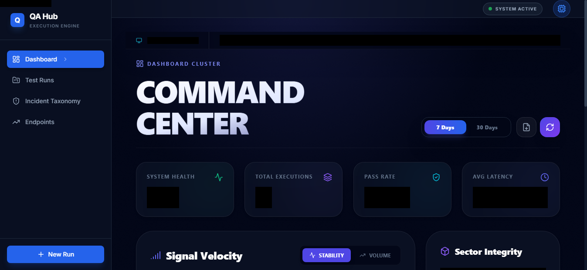
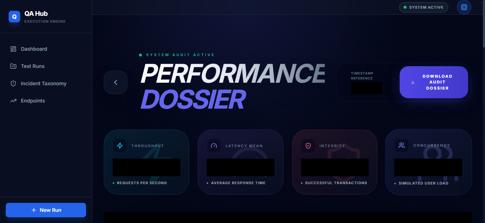
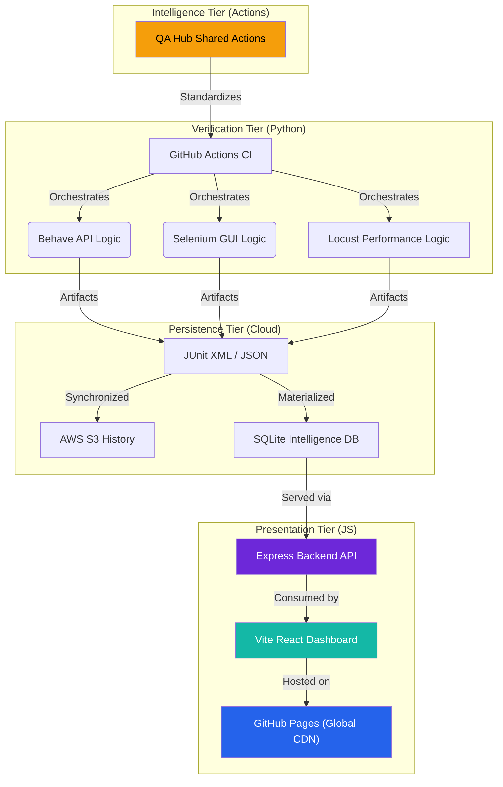

# <div align="center">🛡️ QA COMMAND CENTER</div>

<div align="center">
  <h3>Next-Gen Orchestration & Engineering Intelligence</h3>
  <p><i>A high-performance, ultra-premium observation layer bridging technical execution and executive decision-making.</i></p>
</div>

<div align="center">

[](https://www.python.org/)
[](https://react.dev/)
[](https://tailwindcss.com/)
[](LICENSE)

[](https://github.com/carlos-camara/dashboard/actions/workflows/lint.yml)
[](https://github.com/carlos-camara/dashboard/actions/workflows/test_suite.yml)
[](https://github.com/carlos-camara/dashboard/actions/workflows/deploy_frontend.yml)

</div>

<br/>



---

## 🌟 Executive Overview

This is more than a dashboard; it is a **mission-critical ecosystem** for modern engineering teams. Engineered with a **Glassmorphism UI**, it provides surgical-grade insights into your multi-project quality landscape, transforming chaotic logs into actionable intelligence.

> [!IMPORTANT]
> **Unified Intelligence**: Aggregated reporting for API (Behave) and GUI (Selenium) test suites in a single, high-fidelity pane.

### 🚀 The Four Pillars
- **Unified Vision**: Aggregated reporting for API (Behave) and GUI (Selenium) test suites in a single pane.
- **Smart Diagnostics**: Automated failure pattern recognition with immersive visual evidence.
- **Performance Digital Twin**: Real-time signal analysis and regression detection using Recharts analytics.
- **Enterprise-Grade CI**: Fully automated lifecycle from linting to report archival in AWS S3.

---

## 📑 Table of Contents

- [Executive Overview](#-executive-overview)
- [Live Experience](#-live-experience)
- [Features Matrix](#-features-matrix)
- [Cutting-Edge Features](#-cutting-edge-features)
  - [Performance Digital Twin](#-performance-digital-twin)
  - [PR Intelligence](#-pr-intelligence)
- [Architecture](#️-architecture-decoupled-full-stack)
- [CI/CD Ecosystem](#️-performance-driven-cicd)
- [Navigation & Initialization](#-navigation--initialization)
- [Verification Engine](#-verification-engine)
- [Ecosystem Architecture](#-ecosystem-architecture)
- [Collaboration & Support](#-collaboration--support)

---

## 🌐 Live Experience

The future of test reporting is already online. Experience the ultra-premium interface here:

> **[🚀 Access Live Dashboard](https://carlos-camara.github.io/dashboard/)**

---

## 📊 Features Matrix

| Ecosystem | Intelligence Layer | Technology Stack |
| :--- | :--- | :--- |
| **Unified Reporting** | Aggregated Vision for API & GUI | `Behave`, `Selenium`, `Vite` |
| **Performance Digital Twin** | Signal Velocity & Latency Audit | `Recharts`, `Custom Algorithms` |
| **Visual Evidence** | Automated High-Res Evidence Capture | `html2canvas`, `AWS S3` |
| **Intelligent Dossiers** | Executive-Ready PDF Artifacts | `jsPDF`, `Modular Rendering` |
| **Incremental Cloud** | High-Performance S3 Synchronization | `AWS SDK`, `Incremental Sync` |
| **PR Intelligence** | Dynamic Labeling & Smart Summaries | `GitHub Actions`, `gh CLI` |

---

## ✨ Cutting-Edge Features

### 📊 Performance Digital Twin
Go beyond binary pass/fail results. Our **Performance Analytics Engine** establishes a technical baseline for your system's health.
- **Signal Velocity**: Interactive time-series charts visualizing throughput trends.
- **Throughput Chronology**: Surgical detection of regression spikes and latency drifts.
- **Spectral Latency Audit**: A heat-map of system responsiveness and SLA adherence.



### 🤖 PR Intelligence
Maximize developer focus with an automated pull request management system:
- **Auto-Labeler**: Precise categorization (`DevOps`, `QA`, `Frontend`, `Backend`) based on modified file paths.
- **Enhanced Reviewer Intelligence**: Changed files are automatically grouped and presented in **collapsible sections**.
- **Smart Checklists**: "Automated Tests" and "Linting" boxes in PRs are automatically checked by CI upon success.
- **High-Fidelity Reporting**: Full test results are injected directly into the PR description with a visual summary table.

---

## 🏗️ Architecture: Decoupled Full-Stack

We leverage a modern, decoupled architecture designed for scale and zero-downtime reliability.



> [!TIP]
> The architecture strictly separates **Execution**, **Persistence**, and **Presentation**, enabling independent scaling and surgical updates without affecting system availability.

---

## 🛠️ Performance-Driven CI/CD

Our pipelines are orchestrated via the **[QA Hub Actions](https://github.com/carlos-camara/qa-hub-actions)** library, ensuring modularity and global standards.

| Status | Pipeline | Operational Responsibility |
| :---: | :--- | :--- |
| `🧹` | **Lint Intelligence** | Super-Linter enforcement for zero-debt documentation and logic. |
| `🛡️` | **Unified Suite** | Surgical execution of API, GUI, and Performance layers. |
| `☁️` | **Incremental Sync** | High-performance report archival with surgical delta detection. |
| `🚀` | **SPA Deployment** | Automated production deployment with native routing support. |
| `🏷️` | **PR Orchestration** | Dynamic labeling, intelligent summarization, and task tracking. |

---

## 🚦 Navigation & Initialization

### 📋 Prerequisites
Prepare your engineering environment with the following dependencies:
- **Node.js**: v20+ (LTS Preferred)
- **Python**: v3.11+
- **Chrome / Chromedriver**: Required for full GUI verification.
- **AWS Infrastructure**: Optional for remote persistent reporting.

### 💻 Full-Stack Setup
1. **Registry Acquisition**:
   ```bash
   git clone https://github.com/carlos-camara/dashboard.git
   cd dashboard
   ```

2. **Ecosystem Initialization**:
   ```bash
   # Presentation & Service Tier Dependencies
   npm install
   
   # Verification Tier (Python BDD)
   python -m venv .venv
   .venv\Scripts\activate  # Windows
   pip install -r requirements.txt
   ```

3. **Service Manifestation**:
   ```bash
   # Terminal A: Intelligence Backend (Express/SQLite)
   npm run start-backend
   
   # Terminal B: Presentation Layer (Vite/React)
   npm run dev
   ```

> [!IMPORTANT]
> The dashboard operates as a **Decoupled SPA**. Ensure both the backend (Port 3000) and frontend (Port 5173) are active for full interactivity.

---

## 🧪 Verification Engine

This project includes a high-fidelity verification layer for API, GUI, and performance validation.

### Registry Execution
```bash
# Activate Python virtual environment
.venv\Scripts\activate  # Windows

# API Integrity Suite
behave features/dashboard/api --tags=@smoke

# GUI Presentation Suite
behave features/dashboard/gui --tags=@smoke

# Performance Baseline Suite
behave features/dashboard/performance
```

---

## 📁 Ecosystem Architecture

```text
dashboard/
├── .github/workflows/          # CI/CD Orchestration
├── components/                 # Presentation Tier (Vite/React)
├── features/                   # Verification Tier (BDD/Python)
│   ├── dashboard/             # Project-Specific Scenarios
│   │   ├── api/               # API Verification
│   │   ├── gui/               # GUI Verification
│   │   └── performance/       # Performance Verification
│   ├── page_objects/          # Registry-Driven POM
│   ├── resources/             # Assets & Screenshots
│   └── steps/                 # Step Logic
├── reports/                    # Intelligence Artifacts
├── services/                   # Service Tier (Node.js/SQLite/S3)
├── server.js                   # Intelligence API Core
└── index.html                  # Presentation Core
```

---

## 🤝 Collaboration & Support

We prioritize high-fidelity engineering standards and open collaboration.
- 📋 [Contributing Guide](CONTRIBUTING.md)
- 📝 [Project Chronology](CHANGELOG.md)
- 🛡️ [Security Policy](SECURITY.md)
- 📜 [Code of Conduct](CODE_OF_CONDUCT.md)

---

## 📄 License

This project is licensed under the MIT License - see the [LICENSE](LICENSE) file for details.

---

<div align="center">
  <i>Designed & Engineered with Precision by <b><a href="https://github.com/carlos-camara">Carlos Cámara</a></b></i>
</div>
