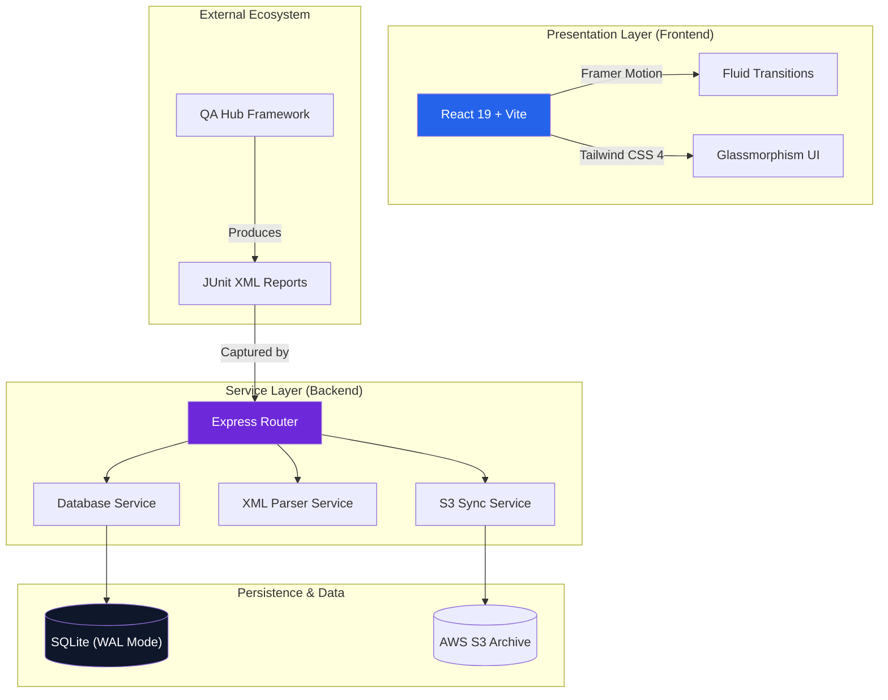

# <div align="center">🛡️ QA COMMAND CENTER</div>

<div align="center">
  <h3>Next-Gen Orchestration & Engineering Intelligence</h3>
  <p><i>A high-performance, ultra-premium observation layer bridging technical execution and executive decision-making.</i></p>
</div>

<div align="center">

[](https://www.python.org/)
[](https://react.dev/)
[](https://tailwindcss.com/)
[](LICENSE)

[](https://github.com/carlos-camara/dashboard/actions/workflows/lint.yml)
[](https://github.com/carlos-camara/dashboard/actions/workflows/test_suite.yml)

</div>

<br/>


---

## 🌟 Executive Overview

This is more than a dashboard; it is a **mission-critical ecosystem** for modern engineering teams. Engineered with a **Modular Backend** and a **Glassmorphism UI**, it provides surgical-grade insights into your multi-project quality landscape, transforming chaotic logs into actionable intelligence.

### 🚀 The Four Pillars
- **Unified Vision**: Aggregated reporting for API (Behave) and GUI (Selenium) test suites in a single pane.
- **High-Fidelity Animations**: Smooth transitions powered by Framer Motion for a premium user experience.
- **Modular Architecture**: Clean separation of concerns between DB, S3 Sync, and XML Parsing.
- **Enterprise-Grade CI**: Fully automated lifecycle from linting to report archival in AWS S3.

---

## 🏗️ Technical Architecture

The Command Center is built on a decoupled, service-oriented architecture designed for scalability and maintainability.



---

## 🚦 Quick Start

### 📋 Prerequisites
- **Node.js 20+** (LTS Recommended)
- **Python 3.11+**
- **AWS Credentials** (Optional, for S3 sync)

### 💻 Local Deployment

1. **Clone & Install**:
   ```bash
   git clone https://github.com/carlos-camara/dashboard.git
   cd dashboard
   npm install
   ```

2. **Run Services**:
   ```bash
   npm run start-backend  # Launches modular Express server
   npm run dev            # Launches Vite frontend with HMR
   ```

3. **Automation Engine (Optional)**:
   ```bash
   python -m venv .venv
   source .venv/bin/activate # or .venv\Scripts\activate on Windows
   pip install -r requirements.txt
   ```

---

## 🛠️ Unified CI/CD Ecosystem

Our pipelines are powered by the **[QA Hub Actions](https://github.com/carlos-camara/qa-hub-actions)** library.

| Status | Pipeline | Core Responsibility |
| :---: | :--- | :--- |
| `🧹` | **Lint Codebase** | Super-Linter enforcement for zero-debt documentation and code. |
| `🛡️` | **Unified Suite** | Parallel execution of API, GUI, and Performance layers. |
| `📦` | **Upload Results** | Automated merging and committing of reports. |
| `🏷️` | **PR Intelligence** | Dynamic labeling and contributor assignment. |

---

<div align="center">
  <i>Designed & Engineered with ❤️ by <b>[Carlos Cámara](https://github.com/carlos-camara)</b></i>
</div>
