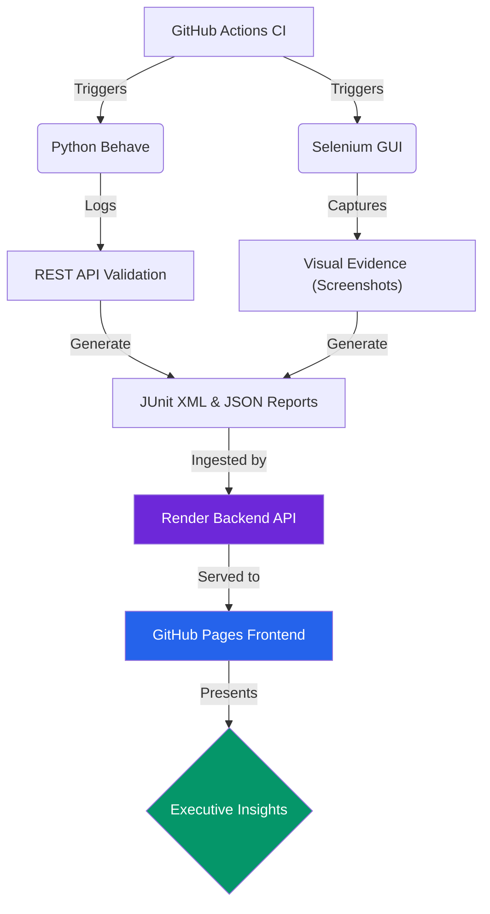

# QA COMMAND CENTER
> [!IMPORTANT]
> **NEXT-GEN ORCHESTRATION & INTELLIGENCE PLATFORM**
>
> A complete visualization layer that bridges the gap between technical execution logs and executive decision-making.

<div align="center">

[](https://www.python.org/)
[](https://react.dev/)
[](https://tailwindcss.com/)
[](LICENSE)

[](https://github.com/carlos-camara/dashboard/actions/workflows/lint.yml)
[](https://github.com/carlos-camara/dashboard/actions/workflows/test_suite.yml)

</div>

<br/>


## 🌟 Executive Overview

This is a **high-performance, ultra-premium QA ecosystem** designed for modern engineering teams. Built with a state-of-the-art **Glassmorphism UI**, it provides real-time insights into your multi-project quality landscape, moving beyond simple test pass/fail metrics.

### 🚀 Key Pillars
- **Unified Vision**: One dashboard for API (Behave) and GUI (Selenium) test suites across all your repositories.
- **Smart Diagnostics**: Identifies failure patterns and provides immersive visual proof (screenshots) for every step.
- **Micro-Services Ready**: Professional-grade assertion engine for complex REST flows and contract validation.
- **Enterprise Aesthetics**: Immersive dark mode, fluid transitions, and a mobile-responsive interface.

---

## 🌐 Live Demonstration

Experience the future of test reporting. The dashboard is live and accessible globally:

> **[View Live Dashboard](https://carlos-camara.github.io/dashboard/)**

---

## ✨ New Generation Features

### 📊 Performance Digital Twin
Go beyond functional testing with our new **Performance Analytics Engine**.
- **Signal Velocity**: Visualize throughput trends over time, establishing a baseline for system performance.
- **Throughput Chronology**: Detect regression spikes and latency drifts with precision using interactive bar charts.
- **Spectral Latency Audit**: A heatmap of your system's responsiveness.


### 📑 Smart PDF Dossiers
Generate executive-ready PDF reports with a single click. These aren't just logs; they are **Intelligent Dossiers** containing:
- **Executive Summary**: High-level pass/fail metrics.
- **Failure Analysis**: Detailed breakdown of failed steps with error messages and context.
- **Visual Evidence**: Embedded screenshots of the state at failure.

### 📱 Mobile-First Design
The dashboard is now fully responsive. Whether you are on a 4K monitor or an iPhone, the glassmorphism UI adapts perfectly to provide critical insights on the go.

---

## 📸 Visual Core

The dashboard is structured into specialized views designed for different engineering needs.

<table border="0">
  <tr>
    <td width="33%" align="center">
      <h3>📈 Main Insights</h3>
      
      <p><i>Real-time KPIs and system health metrics at a glance.</i></p>
    </td>
    <td width="33%" align="center">
      <h3>📂 Execution Archives</h3>
      
      <p><i>Historical data exploration with project-based grouping.</i></p>
    </td>
    <td width="33%" align="center">
      <h3>📡 Endpoint Catalog</h3>
      
      <p><i>Technical registry of all infrastructure endpoints and their status.</i></p>
    </td>
  </tr>
</table>

### 🔍 Surgical Diagnostics
When a test fails, the **Run Detail View** allows you to drill down into specific failures, viewing headers, bodies, and visual proof simultaneously.


---

## ☁️ Deployment Strategy

Our infrastructure leverages a decoupled architecture for maximum performance and reliability.

### **Frontend: GitHub Pages**
The React-based dashboard interface is statically generated and hosted on **GitHub Pages**. This ensures:
- **Global Edge Delivery**: Lightning-fast load times worldwide.
- **Zero-Downtime Updates**: Atomic deployments triggered automatically by our CI pipelines.
- **Security**: Hardened static assets with no server-side attack surface.

### **Backend: Render**
The reporting API and data aggregation layer run on **Render Cloud**. This provides:
- **Scalable Compute**: Automatically adjusts resources based on test suite load.
- **Persistent Data**: SQlite/PostgreSQL integrations for long-term historical analysis.
- **Health Checks**: Automated liveness probes to ensure reporting availability.

---

## 🏗 System Architecture

We utilize a modern stack to ensure scalability and developer comfort.



---

## 🛠 Feature Showcase

### 🔍 Technical API Validation
- **Contract & Schema**: Automatic validation of response structures against YAML definitions.
- **SLA Monitoring**: Integrated performance benchmarking for response times.
- **Traceability**: Comprehensive logging of headers and payloads for every request.

### 🌐 Advanced GUI Automation
- **YAML Locator Engine**: Maintainable tests with descriptive element references.
- **Smart Waits**: Industrial-grade synchronization for dynamic modern web apps.
- **Evidence Collection**: High-resolution screenshots on every interaction and failure.

---

## 🚦 Getting Started

### 📋 Prerequisites
- **Python 3.11+**
- **Node.js 20+**
- **Chrome / Chromedriver** (for local GUI tests)

### 💻 Local Setup

1. **Clone & Browse**:
   ```bash
   git clone https://github.com/carlos-camara/dashboard.git
   cd dashboard
   ```

2. **Backend & Test Logic**:
   ```bash
   python -m venv .venv
   source .venv/bin/activate  # Windows: .venv\Scripts\activate
   pip install -r requirements.txt
   ```

3. **Frontend Dashboard**:
   ```bash
   npm install
   ```

---

## 🏃 Execution Commands

| Mode | Command | Description |
| :--- | :--- | :--- |
| **Development** | `npm run dev` | Spins up the dashboard UI locally |
| **API Smoke** | `./run_api_smoke_reports.ps1` | Rapid validation of core endpoints |
| **GUI Smoke** | `./run_gui_smoke_reports.ps1` | Visual verification of critical paths |
| **Backend** | `npm run start-backend` | Starts the mock API and database services |

---

## 🛡️ CI/CD Workflow
Our **GitHub Actions** pipeline orchestrates the entire lifecycle:
1. **Linting**: Enforces strict code quality standards for Python and TypeScript.
2. **Unified Suite**: Runs API and GUI tests in parallel within a headless environment.
3. **Auto-Publishing**: Merges artifacts and deploys the frontend to GitHub Pages.

> [!TIP]
> Use the `workflow_dispatch` event to manually trigger a full suite validation from the GitHub UI.

<!-- -->

> **Designed & Engineered by [Carlos Camara](https://github.com/carlos-camara)**

