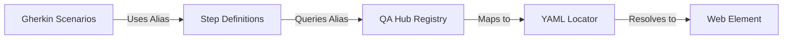

# 🎯 Engineering Precision: YAML-Driven POM

We utilize a sophisticated **YAML-driven Locator System** to achieve absolute decoupling between test orchestration and DOM implementation. This ensures maximum resilience against UI iteration.

---

## 🏛️ The Decoupled Stack



---

## 💎 Strategic Advantages

- **Zero-Code Maintenance**: Rectify broken tests by updating a single YAML entry—no Python refactoring required.
- **Abstracted Selection**: Step definitions remain agnostic of the underlying selector type (XPath, CSS, ID).
- **Ubiquitous Language**: Stakeholders can understand exactly which UI components are being validated through descriptive YAML keys.

---

## 📂 Registry Structure

The registry is organized by view-port and logical component:

```text
features/page_objects/locators/
├── dashboard.yaml      # Portal KPI metrics and timeline
├── sidebar.yaml        # Navigation and identity orchestration
├── execution_runs.yaml # Historical data and filtering
└── project_detail.yaml # Project-specific health analytics
```

---

## 📝 Additive Lifecycle

To register a new high-fidelity element:

1. **Locate**: Identify the most stable attribute (prefer `data-testid`).
2. **Register**: Add the entry to the relevant YAML view.
   ```yaml
   kpi_pass_rate_value: "xpath://div[@id='pass-rate-display']"
   timeline_zoom_btn: "#zoom-control"
   ```
3. **Orchestrate**: Reference the key in your Gherkin.
   ```gherkin
   Then the "kpi_pass_rate_value" should display "98.5%"
   ```

---

## 🛡️ Best Practices

> [!TIP]
> **Static IDs Over Dynamic XPaths**: Avoid fragile absolute paths. If a `data-testid` is missing, collaborate with the frontend team to add it rather than hacking a complex XPath.

- **Flattening**: Use descriptive, snake_case identifiers.
- **Granularity**: Keep YAML files focused on single views to prevent registry bloat.
- **Framework Native**: Leverage the framework's built-in `wait_load` and `wait_visibility` flags within the YAML registry.

---

<div align="center">
  <i>"Code changes. Logic evolves. Locators remain stable."</i>
</div>
